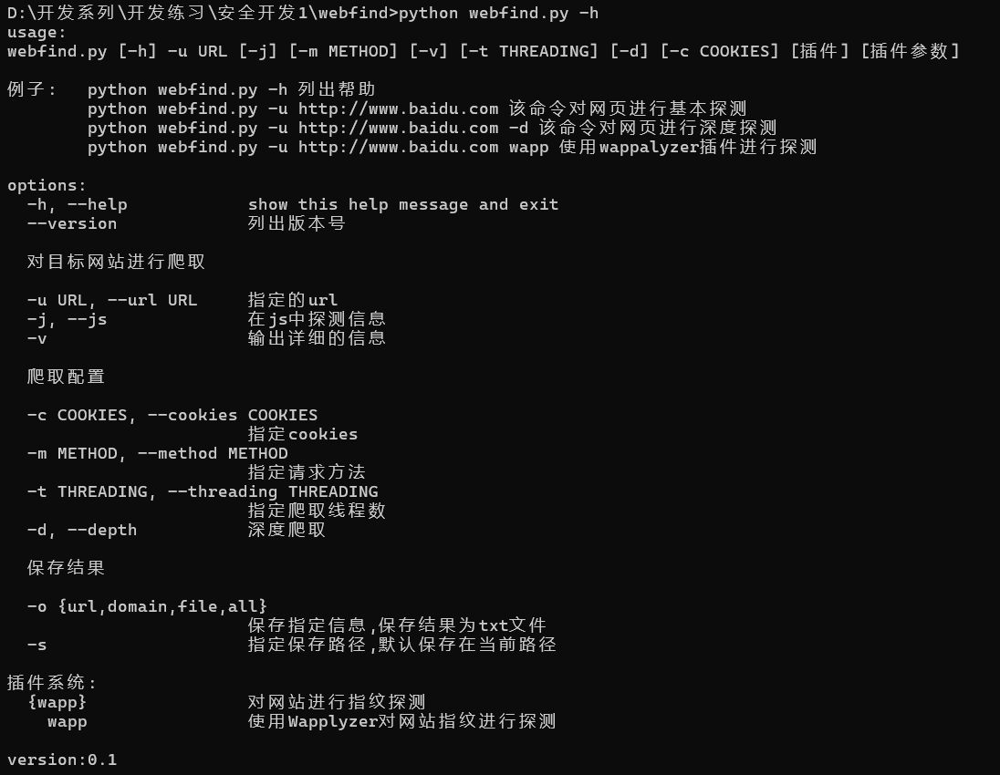
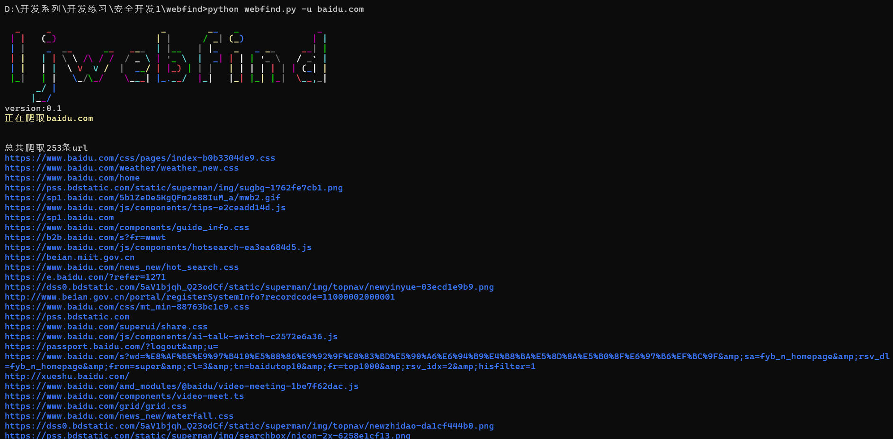

# webfind

## 1. 简介

webfind 是一款高性能的web敏感信息收集器,拥有自己的插件系统,能够快速的在前端网页提取url,子域名,js链接和文件链接

提取URL的正则部分使用的是[LinkFinder](https://github.com/GerbenJavado/LinkFinder)

## 2. 下载和使用

### 在命令行窗口运行如下命令

```
git clone https://github.com/ymlj/webfind
pip install requirements.txt
```

### 使用

```
python webfind.py -h

usage:
webfind.py [-h] -u URL [-j] [-m METHOD] [-v] [-t THREADING] [-d] [-c COOKIES] [插件] [插件参数]

例子:   python webfind.py -h 列出帮助
        python webfind.py -u http://www.baidu.com 该命令对网页进行基本探测
        python webfind.py -u http://www.baidu.com -d 该命令对网页进行深度探测
        python webfind.py -u http://www.baidu.com wapp 使用wappalyzer插件进行探测

options:
  -h, --help            show this help message and exit
  --version             列出版本号

  对目标网站进行爬取

  -u URL, --url URL     指定的url
  -j, --js              在js中探测信息
  -v                    输出详细的信息

  爬取配置

  -c COOKIES, --cookies COOKIES
                        指定cookies
  -m METHOD, --method METHOD
                        指定请求方法
  -t THREADING, --threading THREADING
                        指定爬取线程数
  -d, --depth           深度爬取

  保存结果

  -o {url,domain,file,all}
                        保存指定信息,保存结果为txt文件
  -s                    指定保存路径,默认保存在当前路径

插件系统:
  {wapp}                对网站进行指纹探测
    wapp                使用Wapplyzer对网站指纹进行探测

version:0.1
```

## 功能

- 提取网页所有url
- 提取网页所有域名
- 提取网页敏感文件

## 使用截图





## 计划

- [ ] gui界面
- [ ] 这定义匹配规则
- [ ] dns解析插件
- [ ] sql注入分析插件
- [ ] waf探测插件
- [ ] cdn分辨插件
- [ ] xss分析插件
- [ ] 更强大的指纹匹配规则
- [ ] 保存文件的格式更多样

> 立了好多flag!!!

## 鸣谢项目

本项目参考了如下项目

- [jsfind](https://github.com/Threezh1/JSFinder)
- [TideFinger](https://github.com/TideSec/TideFinger)

> 致敬开源

## 作者

作者是一个普通的安全开发成员,如果你对本工具感兴趣,请点击右上角的星星⭐ヾ(≧▽≦*)o

梨酱最喜欢星星啦
